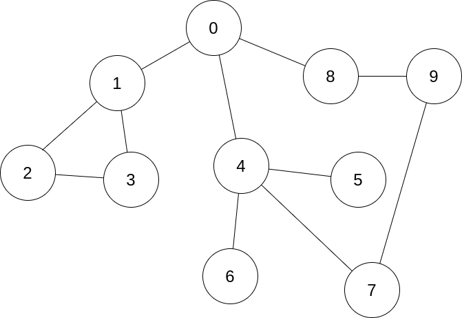

# GraphAdjacencyMatrix

Klasa reprezentująca graf nieskierowany jako macierz sąsiedztwa.

### Wprowadzenie:

W pliku main.cpp znajdują się testy zaimplementowanych metod. 
Plik main.cpp uruchamia się za pomocą pliku Makefile. W pliku Makefile znajdują się komendy pozwalające
na skompilowanie programu oraz jego uruchomienie. W tym celu należy wpisać w konsoli polecenie  
`make all`  
plik main.cpp zostanie skompilowany oraz uruchomiony, a na konsoli zostanie wyświetlona macierz sąsiedztwa
reprezentująca poniższy graf:

Wyświetlone zostaną również kolejne wierzchołki odwiedzane podczas przechodzenia grafu
algorytmami BFS i DFS.

### Zaimplementowano metody:

`display()` - wyświetla macierz sąsiedztwa\
`add_node()` - dodaje kolejny wierzchołek do grafu\
`add_edge(int node1, int node2)` - dodaje krawędź pomiędzy wierzchołkami node1 i node2\
`get_nodes()` - zwraca liczbę wierzchołków\
`get_edges()` - zwraca liczbę krawędzi\
`del_edge(int node1, int node2)` - usuwa krawędź pomiędzy wierzchołkami node1 i node2   
`BFS()` - przechodzi po wszystkich wierzchołkach grafu zgodnie
z algorytmem bread firs search i wyświetla je, przejście zaczyna się od wierzchołka "0"  
`BFS(int node)` -  przechodzi po wszystystkich wierzchołkachgrafu zgodnie 
z algorytmem bread first search i wyświetla je, przejscie zaczyna się od wierchołka node  
`DFS()` - przechodzi po wszystkich wierzchołkach grafu zgodnie 
z algorytmem depth first search i wyświetla je, przejcie zaczyna się od wierzchołka "0"  
`DFS(int node)` -  przechodzi po wszystystkich wierzchołkachgrafu zgodnie 
z algorytmem bdepth first search i wyświetla je, przejscie zaczyna się od wierchołka node

